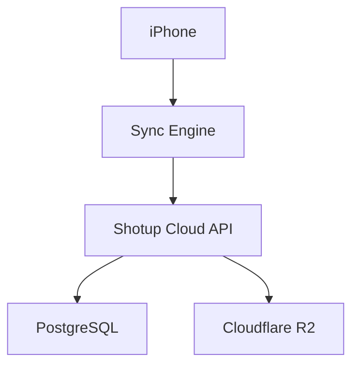

# Shotup Cloud

Cloud synchronization backend for the Shotup Director's Viewfinder ecosystem.

## Overview

Shotup Cloud is the backend service for cloud sync in Shotup Director's Viewfinder. It provides authentication, metadata synchronization, secure media upload/download coordination, and backend media reconciliation for Shotup iOS.

The backend is built with Vapor in Swift. It uses PostgreSQL for canonical metadata persistence, Cloudflare R2 for media object storage, and JWT authentication for protected API routes.

## Features

- ✅ User authentication
- ✅ Metadata synchronization
- ✅ Secure media upload
- ✅ Presigned uploads
- ✅ Presigned downloads
- ✅ Media verification
- ✅ Orphan repair workflow
- ✅ Structured logging
- ✅ PostgreSQL persistence

## Architecture



The API stores metadata in PostgreSQL and stores media binaries in Cloudflare R2. The iOS app uploads and downloads media through presigned URLs issued only after backend authentication and authorization.

## Current Project Status

- ✅ Phase 1: Foundation
- ✅ Phase 2: Authentication
- ✅ Phase 3: Metadata Sync
- ✅ Phase 4: Media Upload
- ✅ Phase 5: Media Download
- ✅ Phase 6: Upload Reliability
- ✅ Phase 7: Cloud Sync Foundation

Phase 8, Cloud Restore and Multi-Device Sync, is planned.

## Technology Stack

- Swift
- Vapor
- Fluent
- PostgreSQL
- Cloudflare R2
- JWT
- Docker, available for containerized deployment/testing and subject to further production hardening

## Repository Structure

```text
.
├── api/
│   ├── Sources/
│   ├── Tests/
│   ├── Architecture/
│   └── Docs/
├── docs/
├── infrastructure/
├── scripts/
├── web/
└── README.md
```

## Getting Started

Start with the developer guides:

- [Local Development Setup](api/Docs/Local-Development-Setup.md)
- [Deployment Guide](api/Docs/Deployment-Guide.md)
- [Environment Variables Reference](api/Docs/Environment-Variables.md)

## Documentation

Documentation is split by purpose:

- [Architecture](api/Architecture): system design, milestone planning, sync behavior, schema, security, operations, and integration contracts.
- [Docs](api/Docs): developer-facing setup, deployment, environment, API examples, and contribution guides.

## Current Validation

The Phase 7 Cloud Sync Foundation has been validated with:

- 80 shots
- 80 `media_assets`
- 0 orphaned uploads
- Repair workflow validated
- Media reconciliation validated

## Roadmap

Planned areas include:

- Phase 8 Cloud Restore
- Multi-device sync
- Conflict detection
- Background download
- Project collaboration
- Cloud thumbnails

## License

License to be determined.

## Author

Omar Gelashvili  
Still Colors LLC  
Shotup Director's Viewfinder
