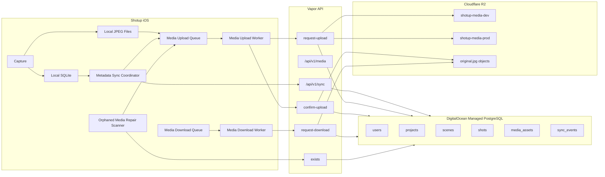
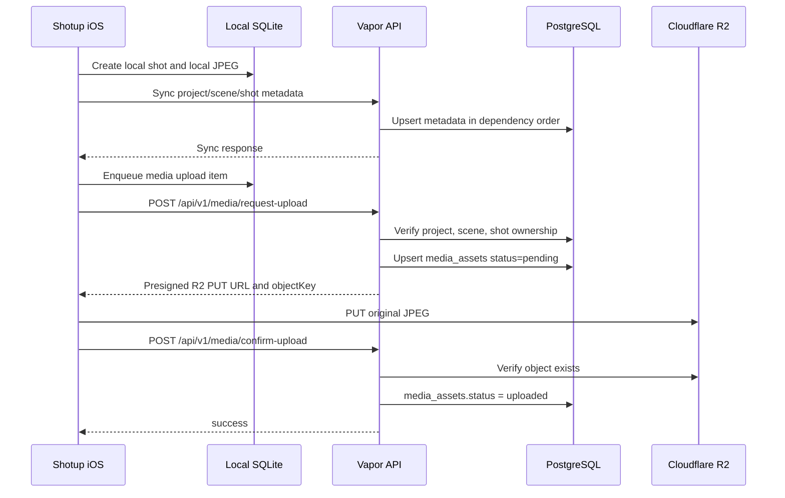
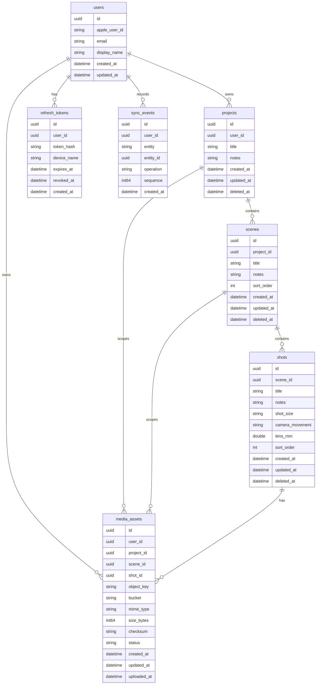

# Shotup Cloud Sync Architecture

## 1. Overview

Shotup Cloud sync is built around a local-first iOS architecture backed by a Vapor API, DigitalOcean Managed PostgreSQL, and Cloudflare R2 object storage. The completed Cloud Sync Foundation separates metadata synchronization from media transfer so that project structure and frame records can sync independently from large JPEG upload and download operations.

The foundation includes:

- iOS local SQLite as the device source of truth while offline.
- Metadata sync for projects, scenes, and shots.
- A media upload queue for captured local JPEGs.
- A media download queue for remote media recovery.
- A Vapor API for authenticated sync, media upload, media download, and repair checks.
- DigitalOcean Managed PostgreSQL for canonical cloud metadata.
- Cloudflare R2 for original JPEG object storage.
- Backend media reconciliation through `media_assets` rows and explicit existence checks.

Metadata rows and media objects are intentionally linked by IDs but handled by different flows. A shot can be created locally and synchronized as metadata before the original JPEG is uploaded to R2. The `media_assets` table records backend knowledge of media state, while the R2 object stores the binary payload.

## 2. High-Level Architecture Diagram



## 3. Core Responsibilities

### iOS app

The iOS app owns local capture, local persistence, queueing, and user-visible state. It records projects, scenes, shots, and local JPEG paths in SQLite, then coordinates metadata sync and media transfer as separate tasks. It must preserve local work when the network or backend is unavailable.

### Local SQLite

Local SQLite is the offline-capable local source of truth for the app. It stores user-created project hierarchy, shot metadata, sync state, and queue state needed by upload, download, and repair workflows.

### Metadata sync coordinator

The metadata sync coordinator batches local project, scene, and shot changes and sends them to the Vapor sync API. It is responsible for dependency-aware ordering on the client side and for isolating individual change failures so a single missing dependency or conflict does not poison the entire batch.

On the backend, `SyncService` also dependency-sorts incoming changes before applying them.

### Media upload worker

The media upload worker consumes upload queue items after metadata sync has created the corresponding backend project, scene, and shot rows. It calls `POST /api/v1/media/request-upload`, uploads the JPEG to the returned presigned R2 PUT URL, then calls `POST /api/v1/media/confirm-upload`.

### Media download worker

The media download worker consumes download queue items for frames whose original media is missing locally but exists on the backend. It calls `POST /api/v1/media/request-download`, downloads from the returned presigned R2 GET URL, and stores the JPEG back into local media storage.

The download path exists in the backend and is part of the foundation, but the production client pipeline is less mature than upload and is expected to be expanded in Phase 8.

### Orphaned media repair scanner

The orphaned media repair scanner detects local queue state that says media has uploaded when the backend does not have a corresponding `media_assets` row. It uses the backend-aware `POST /api/v1/media/exists` endpoint to verify cloud state and re-enqueues uploads when the backend is missing media metadata.

### Vapor API

The Vapor API authenticates users, applies metadata sync, issues presigned upload/download URLs, records media assets, verifies media state, and emits structured logs. Relevant backend files include:

- `Sources/api/Features/Sync/Services/SyncService.swift`
- `Sources/api/Features/Media/MediaService.swift`
- `Sources/api/Features/Media/Controllers/MediaController.swift`
- `Sources/api/Infrastructure/Storage/R2StorageService.swift`
- `Sources/api/Infrastructure/Storage/R2ObjectKeyBuilder.swift`

### PostgreSQL

DigitalOcean Managed PostgreSQL is the canonical backend metadata store. It stores users, project hierarchy, shot metadata, refresh tokens, sync events, and `media_assets` rows that bind frames to R2 object keys.

### Cloudflare R2

Cloudflare R2 stores original JPEG objects. The API does not proxy full media bytes during normal upload/download; it returns presigned URLs and lets the iOS client transfer directly to or from R2.

## 4. Metadata Sync Flow

Metadata sync applies project hierarchy in dependency order:

1. Project
2. Scene
3. Shot

This ordering is required because scenes depend on projects, and shots depend on scenes. Backend ownership and authorization checks also traverse these relationships.

`SyncService` defines `entityApplyOrder` as:

- `.project: 0`
- `.scene: 1`
- `.shot: 2`

Before applying a sync batch, `SyncService.orderedByDependency(_:)` sorts changes by that rank while preserving original order among changes with the same dependency rank. Each change is then applied through the appropriate handler from `SyncRegistry`.

Per-change error isolation is deliberate. If a handler returns a conflict, or throws an `Abort`, `SyncService` appends a `SyncConflict` for that entity and continues processing the rest of the batch. This prevents one bad change from blocking unrelated changes.

This was required because early sync batches could arrive with child entities before their parents. The observed race was a historical `Scene not found` or `Frame not found` failure where the scene or shot existed locally and was included in the same sync batch, but the backend tried to apply the child before its dependency existed in PostgreSQL. Dependency sorting removes that class of race for Project to Scene to Shot ordering.

## 5. Media Upload Flow



Capture creates both a local shot record and a local JPEG. Metadata sync must complete first because `request-upload` validates the backend `Project`, `Scene`, and `Shot` rows before issuing a presigned upload URL. If any dependency is missing, `MediaService.requestUpload` returns:

- `Project not found`
- `Scene not found`
- `Frame not found`

Once metadata exists on the backend, the media upload worker sends an upload queue item to `POST /api/v1/media/request-upload`. The backend validates ownership, normalizes the JPEG content type, generates an R2 object key through `R2ObjectKeyBuilder.originalFrameKey`, creates or updates a pending `media_assets` row, and returns a presigned R2 PUT URL.

After the client uploads the JPEG directly to R2, it calls `POST /api/v1/media/confirm-upload` with the object key, size, checksum, and MIME type. The backend verifies the pending asset belongs to the user, checks that the object exists in R2, validates `image/jpeg`, and updates `media_assets.status` to `uploaded`.

Trace IDs propagate across the upload flow through `X-Trace-ID`. `request-upload` and `confirm-upload` should use the same trace ID so logs can connect the API request, R2 PUT interval, confirm request, and final database update.

## 6. Media Download Flow

The backend download contract is `POST /api/v1/media/request-download`. The request identifies a frame by `frameID`. `MediaService.requestDownload` looks up the uploaded `media_assets` row, verifies the user owns it, rejects pending media with `Media not uploaded yet`, and returns a presigned R2 GET URL plus the object key and expiration time.

The intended client flow is:

1. Detect that local media is missing for a known frame.
2. Add a download queue item.
3. Call `POST /api/v1/media/request-download`.
4. Download the JPEG from the presigned GET URL.
5. Store the JPEG in local media storage and update local queue state.

This supports missing media recovery when metadata exists locally but the original JPEG is absent from device storage. The backend endpoint and tests are present; the automatic iOS download pipeline is currently less mature than upload and is a Phase 8 focus. Manual or targeted recovery can use the existing request-download contract, while broader automatic scheduling remains future work.

## 7. Media Existence Verification

`POST /api/v1/media/exists` checks whether the backend has a `media_assets` row for a frame. It returns whether media exists, plus the media asset ID, object key, and status when present.

This endpoint exists for repair tooling. It answers a metadata question: "Does the backend know about media for this frame?" That is different from requesting a download URL.

Repair tooling uses `exists` to compare local queue state with backend state without requiring the media to be uploaded and downloadable. If no row exists, the response is a clean `exists: false` rather than a download-specific error. If a row exists, repair can inspect the status and decide whether to leave it alone, retry confirmation, or re-enqueue upload.

`request-download` should not be used for existence checks because it is a transfer endpoint. It requires an uploaded media asset and returns errors for missing or pending assets. Using it as a probe would conflate "no backend media row", "pending upload", and "not downloadable yet" with actual download failures.

## 8. Orphaned Media Repair Flow

The historical issue was a split-brain upload state:

- Local queue state said a frame was uploaded.
- The backend had no corresponding `media_assets` row.
- R2 and PostgreSQL could no longer be reconciled from local queue state alone.

The repair flow is backend-aware:

1. Scan local shots and local media queue state.
2. For each local frame that appears uploaded locally, call `POST /api/v1/media/exists`.
3. If the backend returns `exists: true`, leave the local item reconciled.
4. If the backend returns `exists: false`, treat the item as orphaned from the backend perspective.
5. Re-enqueue upload for the local JPEG.
6. Let the normal upload flow run: metadata dependency check, `request-upload`, R2 PUT, `confirm-upload`.
7. Validate that every shot with local media has a matching backend `media_assets` row.

Final validation after repair:

- Before repair: 80 shots, 68 `media_assets`, 12 orphaned.
- After repair: 80 shots, 80 `media_assets`, 0 orphaned.

## 9. Error Handling and Retry Strategy

Dependency errors during upload are treated as transient when the local metadata sync queue may still be ahead of backend state:

- `Project not found`: transient dependency not ready. Retry metadata sync, then retry media upload.
- `Scene not found`: transient dependency not ready. Retry parent scene sync, then retry media upload.
- `Frame not found`: transient dependency not ready. Retry shot sync, then retry media upload.

Network errors are retryable with backoff. They can occur during metadata sync, `request-upload`, direct R2 PUT, `confirm-upload`, `request-download`, or direct R2 GET. Queue items should remain durable until confirmed complete.

Authentication failures are not normal retry-loop failures. Unauthorized responses require token refresh or user reauthentication. Forbidden responses indicate an ownership or account mismatch and should stop automatic retry until state is inspected.

Permanent failures include unsupported content type, invalid object key ownership, malformed requests, missing local JPEG files, and data that cannot satisfy backend ownership checks. These should be surfaced for repair or manual intervention instead of retried indefinitely.

R2 object visibility during confirm can be temporarily inconsistent from the client's perspective. `MediaController.confirmUpload` logs `retryReason: object_not_yet_visible_in_storage` when confirmation fails because the object is not found in storage.

## 10. Observability

Media endpoints use `X-Trace-ID`, implemented by `MediaUploadTrace`. If the client supplies the header, the backend preserves it. Otherwise the backend generates a UUID trace ID and returns it in the response.

`request-upload` and `confirm-upload` should share the same trace ID for a single media transfer. This allows logs to reconstruct the full sequence:

- Upload request started.
- Upload request completed.
- Client PUT interval to R2.
- Confirm request started.
- Confirm request completed.

The backend emits structured log events from `MediaController`, including:

- `media.upload.request.started`
- `media.upload.request.completed`
- `media.upload.request.failed`
- `media.upload.confirm.started`
- `media.upload.confirm.completed`
- `media.upload.confirm.failed`
- `media.download.request.started`
- `media.download.request.completed`
- `media.download.request.failed`

Timing metrics include:

- `requestDurationMs`: API request duration for request-upload or request-download.
- `putDurationMs`: elapsed time between pending media asset creation and confirm-upload start.
- `confirmDurationMs`: API request duration for confirm-upload.
- `totalDurationMs`: elapsed time from pending media asset creation through confirm-upload completion.

## 11. Backend Database Model

Primary backend tables:

- `users`: user identity and profile fields. Includes optional Apple identity fields and timestamps.
- `projects`: top-level project records owned by users.
- `scenes`: scene records belonging to projects.
- `shots`: frame/shot records belonging to scenes.
- `media_assets`: media metadata rows linking users, projects, scenes, and shots to R2 object keys.
- `refresh_tokens`: hashed refresh tokens tied to users and devices.
- `sync_events`: ordered event log used to produce sync tokens and collect remote changes.



`media_assets.object_key` is unique. Foreign keys from `media_assets` to `users`, `projects`, `scenes`, and `shots` use cascade delete, matching the project hierarchy lifecycle.

## 12. Cloud Storage Model

R2 object keys are deterministic and generated by `R2ObjectKeyBuilder.originalFrameKey`:

```text
users/{userID}/projects/{projectID}/scenes/{sceneID}/frames/{frameID}/original.jpg
```

IDs are lowercased UUID strings. The key encodes ownership and hierarchy so media can be inspected and reconciled by user, project, scene, and frame.

Bucket separation:

- `shotup-media-dev`: development and test validation media.
- `shotup-media-prod`: production media.

The bucket name is stored on each `media_assets` row along with the object key, MIME type, size, checksum, status, and upload timestamp.

## 13. Validation Results

Completed validation for the Cloud Sync Foundation:

- DigitalOcean Managed PostgreSQL connected with TLS CA verification using the configured CA certificate.
- Backend tests passing for media contracts, repository behavior, upload, confirm upload, download request, existence checks, and R2 URL generation.
- End-to-end upload validated through metadata sync, `request-upload`, direct R2 PUT, and `confirm-upload`.
- Stress test repaired from:
  - 80 shots
  - 68 `media_assets`
  - 12 orphaned
- Stress test repaired to:
  - 80 shots
  - 80 `media_assets`
  - 0 orphaned

## 14. Known Limitations

- The repair dashboard is DEBUG-only.
- The download pipeline is less mature than the upload pipeline.
- Multi-device conflict resolution is not implemented yet.
- Background `URLSession` production hardening is not complete yet.
- An Xcode test runner discovery issue exists on the iOS side.

## 15. Next Milestones

- Phase 8 Cloud Download: harden automatic download scheduling, local missing-media recovery, and background download behavior.
- Phase 9 Multi-device Sync: add conflict resolution and multi-device reconciliation semantics.
- Phase 10 Collaboration/Web: extend the cloud model toward shared projects, collaboration workflows, and web access.
