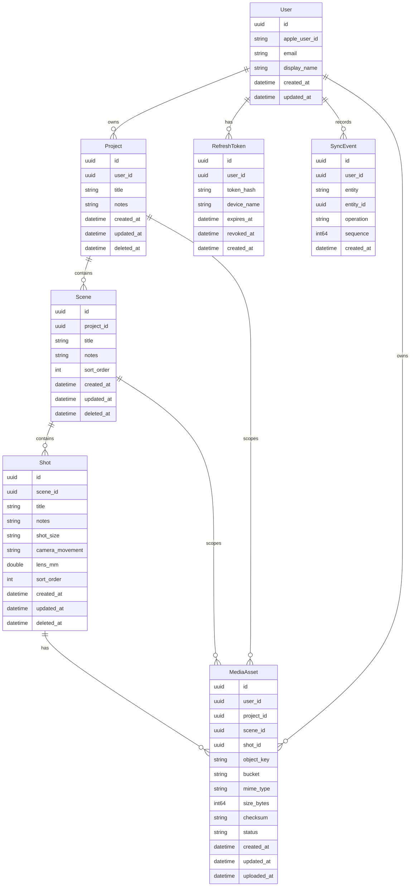

# Shotup Cloud Database Schema

## Purpose

This document describes the PostgreSQL schema used by Shotup Cloud after Phase 7. It covers the backend metadata model, ownership relationships, media metadata, sync event storage, and the boundary between PostgreSQL and Cloudflare R2.

## 1. Overview

Shotup Cloud uses DigitalOcean Managed PostgreSQL as the canonical backend metadata store. The Vapor API connects through Fluent and `FluentPostgresDriver`.

Production-style TLS is supported through CA verification. When `DATABASE_SSL_MODE=require`, `configure.swift` loads a CA file from `DATABASE_CA_CERT`, defaulting to `Certificates/digitalocean-ca.crt`, and configures Postgres TLS trust roots with NIOSSL.

Schema creation is handled by Fluent migrations. The application registers migrations in dependency order in `configure.swift`:

- `CreateUser`
- `CreateProject`
- `CreateScene`
- `CreateShot`
- `CreateMediaAsset`
- `CreateRefreshToken`
- `CreateSyncEvent`

The database stores metadata only. It does not store media binaries. Original JPEG objects are stored in Cloudflare R2, while PostgreSQL stores object keys, bucket names, ownership metadata, status, size, and checksum fields.

## 2. Entity Relationship Diagram



## 3. users

The `users` table represents authenticated Shotup Cloud accounts. It is the root ownership table for projects, refresh tokens, sync events, and media assets.

Key fields:

- `id`: primary UUID.
- `apple_user_id`: optional Apple identity. It has a unique constraint.
- `email`: optional email address.
- `display_name`: optional display name.
- `created_at`: creation timestamp.
- `updated_at`: last update timestamp.

Ownership role:

Every project belongs to a user. Media assets also store `user_id` directly so media authorization can validate ownership without relying only on object key structure.

## 4. projects

The `projects` table stores top-level Shotup projects.

Key fields:

- `id`: primary UUID.
- `user_id`: required foreign key to `users.id`.
- `title`: required project title.
- `notes`: optional notes.
- `created_at`: creation timestamp.
- `updated_at`: last update timestamp.
- `deleted_at`: optional soft-delete timestamp.

Projects belong to users. The foreign key uses cascade delete, so hard-deleting a user removes that user's projects.

Soft delete behavior is represented by `deleted_at`. Sync handlers can use this timestamp to propagate deletion without immediately removing the row. This allows tombstones to participate in sync.

Sync role:

Projects are the parent entity in the metadata dependency chain. They must be applied before scenes.

## 5. scenes

The `scenes` table stores ordered scenes inside projects.

Key fields:

- `id`: primary UUID.
- `project_id`: required foreign key to `projects.id`.
- `title`: required scene title.
- `notes`: optional notes.
- `sort_order`: required integer ordering field.
- `created_at`: creation timestamp.
- `updated_at`: last update timestamp.
- `deleted_at`: optional soft-delete timestamp.

Scenes depend on projects. The foreign key uses cascade delete, so hard-deleting a project removes its scenes.

Sync ordering role:

Scenes must sync after projects and before shots. Applying a scene before its project exists causes dependency failures such as `Project not found`.

## 6. shots

The `shots` table stores Shotup shot records. In the media API, the shot ID maps to the iOS frame concept and is passed as `frameID`.

Key fields:

- `id`: primary UUID.
- `scene_id`: required foreign key to `scenes.id`.
- `title`: required shot title.
- `notes`: optional notes.
- `shot_size`: optional shot size.
- `camera_movement`: optional camera movement.
- `lens_mm`: optional lens value.
- `sort_order`: required integer ordering field.
- `created_at`: creation timestamp.
- `updated_at`: last update timestamp.
- `deleted_at`: optional soft-delete timestamp.

Shots depend on scenes. The foreign key uses cascade delete, so hard-deleting a scene removes its shots.

Media relationship:

`media_assets.shot_id` points to `shots.id`. A shot can exist before its media has uploaded. The upload flow creates a pending `media_assets` row only after the backend validates the project, scene, and shot dependencies.

## 7. media_assets

The `media_assets` table stores backend metadata for media objects uploaded to Cloudflare R2. It does not store the JPEG binary.

Key fields:

- `id`: primary UUID.
- `user_id`: required UUID reference to `users.id`.
- `project_id`: required UUID reference to `projects.id`.
- `scene_id`: required UUID reference to `scenes.id`.
- `shot_id`: required UUID reference to `shots.id`.
- `object_key`: required R2 object key.
- `bucket`: required R2 bucket name.
- `mime_type`: required MIME type. Phase 7 upload accepts `image/jpeg`.
- `size_bytes`: required object size, set during upload confirmation.
- `checksum`: optional checksum supplied by the client.
- `status`: required upload status.
- `created_at`: creation timestamp.
- `updated_at`: last update timestamp.
- `uploaded_at`: optional timestamp set when upload is confirmed.

Statuses:

- `pending`: `request-upload` has prepared the backend row and issued a presigned R2 PUT URL.
- `uploaded`: `confirm-upload` has verified object existence in R2 and recorded upload metadata.

Constraints and delete behavior:

- `object_key` is unique.
- `user_id`, `project_id`, `scene_id`, and `shot_id` all reference their parent tables with cascade delete in `CreateMediaAsset`.

Implementation notes:

- `MediaService.requestUpload` validates project, scene, and frame ownership before creating a pending asset.
- `FluentMediaRepository.upsertPendingUpload` creates or resets a pending asset.
- `MediaService.confirmUpload` checks R2 object existence before calling `MediaRepository.markUploaded`.

## 8. refresh_tokens

The `refresh_tokens` table supports auth/session continuity.

Key fields:

- `id`: primary UUID.
- `user_id`: required foreign key to `users.id`.
- `token_hash`: required hashed refresh token. It has a unique constraint.
- `device_name`: optional device label.
- `expires_at`: token expiration timestamp.
- `revoked_at`: optional revocation timestamp.
- `created_at`: creation timestamp.

Refresh tokens belong to users. The foreign key uses cascade delete, so hard-deleting a user removes that user's refresh tokens.

## 9. sync_events

The `sync_events` table records ordered sync events used by the metadata sync protocol.

Key fields:

- `id`: primary UUID.
- `user_id`: required foreign key to `users.id`.
- `entity`: entity name, such as project, scene, or shot.
- `entity_id`: UUID of the changed entity.
- `operation`: operation name.
- `sequence`: monotonically ordered sequence value with a unique constraint.
- `created_at`: event creation timestamp.

Indexes:

- `sync_events_user_id_sequence_idx` on `(user_id, sequence)`.
- `sync_events_entity_entity_id_idx` on `(entity, entity_id)`.

Sync role:

`SyncService` uses the latest event sequence as the sync token and `SyncDownloadCollector` uses sync events to collect changes since a client's previous token.

## 10. Migration Order

Migration order matters because foreign keys reference tables created earlier:

1. `CreateUser`
   Creates the ownership root.
2. `CreateProject`
   References `users`.
3. `CreateScene`
   References `projects`.
4. `CreateShot`
   References `scenes`.
5. `CreateMediaAsset`
   References `users`, `projects`, `scenes`, and `shots`.
6. `CreateRefreshToken`
   References `users`.
7. `CreateSyncEvent`
   References `users` and creates sync indexes.

This order mirrors the application hierarchy and prevents migration-time foreign key failures.

## 11. Ownership and Authorization

Ownership starts at the user:

- A user owns projects.
- Projects contain scenes.
- Scenes contain shots.
- Media assets store direct `user_id`, `project_id`, `scene_id`, and `shot_id` references.

Media authorization checks use those IDs to ensure that a user can only upload, confirm, check, or download media belonging to their own hierarchy.

Expected unauthorized behavior:

- Unauthorized media existence checks return `403`.
- Unauthorized media downloads return `403`.
- Unauthorized media upload requests return `403` when the project or media asset belongs to another user.
- Unauthorized upload confirmation returns `403` when the pending media asset is owned by another user.

The object key is not the authorization source. It is storage metadata. Authorization is based on authenticated user identity and database ownership relationships.

## 12. Data vs Object Storage Boundary

PostgreSQL stores:

- Users and auth/session metadata.
- Project, scene, and shot metadata.
- Sync events.
- Media asset metadata.
- R2 bucket names and object keys.

Cloudflare R2 stores:

- Original JPEG binaries.

The `object_key` field is the bridge between PostgreSQL and R2. It allows the backend to issue presigned upload/download URLs, verify object existence, and reconcile local media state with backend media metadata.

Current object key format:

```text
users/{userID}/projects/{projectID}/scenes/{sceneID}/frames/{frameID}/original.jpg
```

## 13. Validation Queries

Count core tables:

```sql
SELECT COUNT(*) AS project_count FROM projects;
SELECT COUNT(*) AS scene_count FROM scenes;
SELECT COUNT(*) AS shot_count FROM shots;
SELECT COUNT(*) AS media_asset_count FROM media_assets;
```

Count non-deleted project hierarchy rows:

```sql
SELECT COUNT(*) AS active_project_count
FROM projects
WHERE deleted_at IS NULL;

SELECT COUNT(*) AS active_scene_count
FROM scenes
WHERE deleted_at IS NULL;

SELECT COUNT(*) AS active_shot_count
FROM shots
WHERE deleted_at IS NULL;
```

Group media by status:

```sql
SELECT status, COUNT(*) AS count
FROM media_assets
GROUP BY status
ORDER BY status;
```

Find orphaned shots without media assets:

```sql
SELECT s.id AS shot_id, s.scene_id
FROM shots s
LEFT JOIN media_assets ma ON ma.shot_id = s.id
WHERE s.deleted_at IS NULL
  AND ma.id IS NULL
ORDER BY s.created_at;
```

Find media assets by shot:

```sql
SELECT id, shot_id, object_key, bucket, mime_type, size_bytes, checksum, status, uploaded_at
FROM media_assets
WHERE shot_id = '{shotID}'
ORDER BY created_at DESC;
```

Find media assets without uploaded status:

```sql
SELECT id, shot_id, object_key, status, created_at, updated_at
FROM media_assets
WHERE status <> 'uploaded'
ORDER BY updated_at DESC;
```

## 14. Known Limitations

- No thumbnails table yet.
- No media versioning yet.
- No collaboration or permissions table yet.
- No quota or account billing tables yet.
- No checksum enforcement yet.

## 15. Future Schema Candidates

- `project_members`: project collaboration membership and roles.
- `media_thumbnails`: generated thumbnail metadata and R2 keys.
- `media_versions`: versioned originals, replacements, or alternate encodes.
- `sync_conflicts`: durable conflict records for multi-device resolution.
- `storage_usage`: per-user or per-project storage accounting.
- `device_registrations`: device identity, push routing, and per-device sync metadata.
