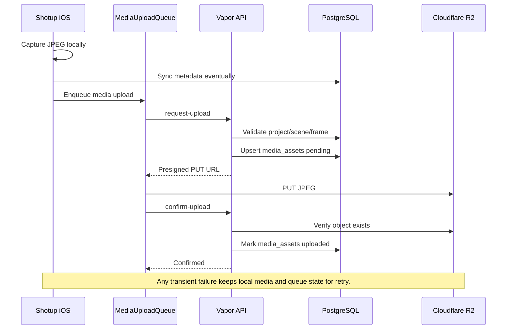

# Failure Recovery Guide

## Purpose

This guide documents how Shotup Cloud survives crashes, network interruptions, backend failures, dependency races, and storage inconsistencies while ensuring eventual consistency. The system is local-first on iOS, metadata-first for backend sync, and queue-based for media transfer.

## 1. Design Goals

- Never lose captured media. A captured JPEG must remain durable in local storage until the backend has confirmed that Cloudflare R2 contains the object and PostgreSQL has an uploaded `media_assets` row.
- Synchronize metadata and media independently. Projects, scenes, and shots sync through the metadata pipeline; JPEG bytes move through the media upload pipeline.
- Make every transient failure recoverable. Offline state, timeouts, dependency races, expired presigned URLs, and temporary backend or storage failures should leave queue items available for retry.
- Keep permanent failures rare and explicit. Data that cannot be retried, such as a missing local JPEG or forbidden ownership mismatch, should be marked clearly instead of silently discarded.
- Avoid manual user recovery. Developer tools such as `SyncDashboard` and repair scanners may expose diagnostics, but normal users should not need to understand queues, SQL, or object storage to recover data.

## 2. Failure Categories

### Network failures

Examples:

- Offline device
- Timeout
- DNS failure
- TLS failure
- Connection reset

Expected behavior:

Network failures are retryable. `MediaUploadQueue` should keep the item durable, and `MediaUploadWorker` should move the item back to a retryable state instead of deleting it. The next automatic retry, manual retry, or `retryPending` pass can resume the upload from the correct phase. If the failure happened after a presigned URL expired, the worker should request a new URL rather than reusing the old one.

### Authentication failures

Examples:

- HTTP 401
- Expired access token

Expected recovery:

Authentication failures should trigger token refresh. If refresh succeeds, the same queue item can be retried. If refresh fails, sync and upload should pause in an authenticated-blocked state. The local media remains on device and the queue item remains recoverable.

### Authorization failures

Example:

- HTTP 403

Expected behavior:

Authorization failures are not retryable as normal transient errors. They usually mean the authenticated user does not own the project, scene, shot, or media asset being accessed. Retrying with the same user and IDs should produce the same result. These failures should be surfaced as permanent or blocked until account state, local IDs, or backend ownership data is inspected.

### Dependency failures

Examples:

- `Project not found`
- `Scene not found`
- `Frame not found`

Expected behavior:

Dependency failures are retryable because metadata and media are synchronized independently. A shot can exist locally while its project, scene, or shot row has not yet been accepted by PostgreSQL. `MediaService.requestUpload` intentionally validates those dependencies before issuing a presigned upload URL. When one is missing, `MediaUploadWorker` should retry metadata sync first, then retry upload.

### Storage failures

Examples:

- R2 unavailable
- Upload timeout
- `confirm-upload` failure
- Backend object missing after client PUT

Expected recovery:

Storage failures are generally retryable. If R2 PUT fails, the worker keeps the item and retries with backoff. If `confirm-upload` fails because the backend cannot see the object yet, the worker can retry confirmation or request a fresh upload flow. `MediaService.confirmUpload` verifies object existence before marking `media_assets` uploaded, which prevents PostgreSQL from claiming an upload succeeded when R2 does not contain the object.

### Local failures

Examples:

- Missing local JPEG
- Deleted local media
- Database corruption

Expected behavior:

Local failures are the highest-risk class because local storage may contain the only copy of captured media before upload completes. A missing JPEG should become a permanent or blocked failure for that queue item unless the file can be restored. Deleted local media may be recoverable only if the backend already has uploaded media and the download pipeline can restore it. Database corruption requires local database recovery or app-level repair; the upload worker should not mark media uploaded without backend confirmation.

## 3. Retry Strategy

`retryPending` should scan queue items that are pending, failed/retryable, or blocked by transient dependency readiness and make them eligible for another attempt.

Retry count should be stored with local queue state when available. It helps avoid hot loops during outages and allows the app or developer tools to distinguish "still retrying" from "needs inspection." Backoff should increase between attempts for network, backend, and storage failures.

Retryable failures include:

- Network failures
- Offline state
- Expired access token after successful refresh
- `Project not found`
- `Scene not found`
- `Frame not found`
- R2 PUT timeout
- Temporary `confirm-upload` object-not-found
- Backend 5xx

Permanent failures include:

- Forbidden ownership response
- Unsupported content type
- Missing local JPEG
- Malformed IDs or request body
- Repeated failures beyond configured retry policy

Manual retry should be available through developer/debug tooling such as `SyncDashboard`. Automatic retry should be the default path for normal transient failures. In both cases, queue items must not disappear until a terminal success or explicit permanent failure is recorded.

## 4. Orphan Detection

The historical orphan problem had three facts at the same time:

- A shot existed.
- The backend `media_assets` row was missing.
- The local upload queue said the media was uploaded.

This could happen when local queue state advanced farther than backend media reconciliation. For example, a crash, failed confirmation, partial retry, or earlier implementation gap could leave the device believing upload work was complete even though PostgreSQL had no durable media record. In that state, local-only queue state was not enough to prove cloud consistency.

Orphan detection exists to find those mismatches and restore the normal upload invariant: each uploaded local frame should have a backend `media_assets` row.

## 5. Backend Reconciliation

The reconciliation design uses:

```text
POST /api/v1/media/exists
```

The endpoint returns:

- `exists`
- `mediaAssetID`
- `objectKey`
- `status`

This endpoint asks the backend whether it knows about media for a frame. It does not request a download URL and does not require the media to be downloadable. That distinction matters because repair needs a clean existence probe, not a transfer operation.

For reconciliation, the backend becomes the source of truth for cloud media state. Local state can say an item uploaded, but only PostgreSQL can confirm that a `media_assets` row exists. If `exists` is false, the local item is treated as missing from the backend and can be re-enqueued.

`MediaService.checkExists` implements the backend check. It looks up media by frame ID through `MediaRepository`, enforces ownership when a row exists, and returns a structured response for repair tooling.

## 6. Repair Workflow

The repair workflow is named "Repair Orphaned Media Uploads."

1. `OrphanedMediaUploadRepairScanner` scans local shots and upload queue state.
2. For each candidate where local state says uploaded, `BackendMediaVerifier` calls `POST /api/v1/media/exists`.
3. If the backend returns `exists: true`, the scanner treats the item as reconciled.
4. If the backend returns `exists: false`, the scanner marks the item as backend-missing.
5. The scanner re-enqueues the local JPEG into `MediaUploadQueue`.
6. The normal `MediaUploadWorker` runs the standard upload state machine.
7. `URLSessionMediaUploadAPI` calls `request-upload`.
8. iOS uploads the JPEG to R2.
9. `URLSessionMediaUploadAPI` calls `confirm-upload`.
10. `MediaService.confirmUpload` verifies the object exists and marks `media_assets` uploaded.
11. The queue item completes.

Repair intentionally reuses the normal upload path. This avoids a second upload mechanism and keeps validation, traceability, and backend state transitions consistent.

## 7. Eventual Consistency

Eventual consistency is acceptable for media uploads because the captured media starts from durable local storage. The user can create work offline, metadata can sync before media, and media can upload later without changing the identity of the project, scene, or shot.

The important invariant is not immediate cloud availability. The important invariant is that every captured media item remains recoverable until it reaches backend-confirmed uploaded state.



## 8. Observability

Upload attempts use trace IDs:

- One `X-Trace-ID` per upload attempt.
- The same trace ID should be used for `request-upload` and `confirm-upload`.
- The backend resolves or generates trace IDs through `MediaUploadTrace`.

Structured backend logging records media request lifecycle events from `MediaController`, including upload request start/completion/failure, confirm start/completion/failure, and download request events.

Timings include:

- Upload duration: client-observed total time for the queue attempt.
- Backend duration: API handler duration for request and confirm endpoints.
- `requestDurationMs`: duration of `request-upload`.
- `putDurationMs`: elapsed time between pending asset creation and confirm start.
- `confirmDurationMs`: duration of `confirm-upload`.
- `totalDurationMs`: elapsed time from pending asset creation through confirmation.

Repair logs should identify scanned count, backend-missing count, re-enqueued count, completed count, and remaining orphan count. They should also include frame IDs or trace IDs when safe for the debug environment.

## 9. Manual Recovery

A developer can verify synchronization with SQL against the backend database.

Count shots:

```sql
SELECT COUNT(*) AS shot_count
FROM shots
WHERE deleted_at IS NULL;
```

Count media assets:

```sql
SELECT COUNT(*) AS media_asset_count
FROM media_assets;
```

Find shots missing media:

```sql
SELECT s.id AS shot_id, s.scene_id
FROM shots s
LEFT JOIN media_assets ma ON ma.shot_id = s.id
WHERE s.deleted_at IS NULL
  AND ma.id IS NULL;
```

Find uploaded media rows:

```sql
SELECT status, COUNT(*) AS count
FROM media_assets
GROUP BY status
ORDER BY status;
```

Verify one frame through the media exists endpoint:

```text
POST /api/v1/media/exists
Authorization: Bearer {token}
Content-Type: application/json

{
  "frameID": "{shotID}"
}
```

Use the DEBUG-only repair dashboard in `SyncDashboard` to run "Repair Orphaned Media Uploads" when local state and backend state need reconciliation. The dashboard should call the same backend verification flow as automated repair and then re-enqueue backend-missing items into the normal upload queue.

## 10. Current Validation

Current validated database result:

- 80 shots
- 80 `media_assets`
- 0 missing media

Repair succeeds. The repair flow restored the system from a state where shots existed without matching backend media rows to a fully reconciled state with no orphaned uploads.

## 11. Future Improvements

- Scheduled reconciliation that periodically compares local upload state with backend `media_assets`.
- Background repair so orphan correction does not require opening DEBUG tooling.
- Checksum verification during or after `confirm-upload`.
- Duplicate detection for repeated local uploads of the same frame.
- Repair metrics for scanned, missing, re-enqueued, succeeded, failed, and skipped items.
- Admin repair endpoint for backend-initiated reconciliation and operational support.
