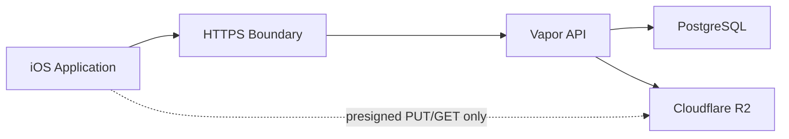

# Shotup Cloud Security Architecture

## Purpose

This document describes the Shotup Cloud security model, including authentication, authorization, media protection, object storage security, database security, and trust boundaries.

## 1. Security Principles

- Least privilege: each component receives only the access it needs. iOS receives short-lived tokens and presigned URLs, not database or R2 credentials.
- Defense in depth: authentication, authorization, database constraints, R2 object isolation, and short-lived URLs work together.
- Zero trust between client and storage: the iOS app never receives raw R2 credentials and cannot freely browse the bucket.
- Backend is authoritative: Vapor decides authentication, authorization, media ownership, and upload/download eligibility.
- Principle of ownership: every protected user resource is scoped to the authenticated user.

## 2. Trust Boundaries



### iOS Application

The iOS app is trusted to preserve local user data and send authenticated requests, but it is not trusted to make authorization decisions. Client-provided IDs, object keys, MIME types, sizes, and checksums are treated as input that the backend must validate.

The iOS app does not receive database credentials or R2 credentials.

### HTTPS

HTTPS protects API traffic in transit. Production clients should only communicate with Shotup Cloud over HTTPS. Direct R2 uploads and downloads also use HTTPS URLs.

### Vapor API

The Vapor API is the trust enforcement boundary. It validates JWTs, authenticates users through JWT middleware, verifies ownership through database lookups, issues presigned URLs, and records media state transitions.

### PostgreSQL

PostgreSQL is trusted as the canonical metadata store. It enforces foreign keys, unique constraints, and persisted ownership relationships. Application code must still filter and validate by authenticated user.

### Cloudflare R2

R2 is trusted to store media objects, but clients do not get broad bucket access. The backend uses R2 credentials to generate operation-specific presigned URLs.

## 3. Authentication

Shotup Cloud uses JWT Bearer authentication for protected API routes.

Access tokens:

- Signed by `JWTService`.
- Include a subject claim and `userID`.
- Expire after one hour in the current implementation.
- Are sent by iOS as `Authorization: Bearer {accessToken}`.

Refresh tokens:

- Stored as hashes in the `refresh_tokens` table.
- Used by `/api/v1/auth/refresh` to rotate or renew authentication.
- Include expiration and optional revocation timestamp in the database model.

Token validation:

- `JWTAuthenticator` implements bearer authentication.
- It verifies the token with Vapor JWT keys as `AuthTokenPayload`.
- On success, it logs in `AuthenticatedUser(id: payload.userID)` for the request.

Development login vs production authentication:

- `POST /api/v1/auth/dev-login` exists for development.
- `POST /api/v1/auth/apple` is the production-oriented Apple Sign-In path.
- Development login must not be exposed as an unrestricted production authentication mechanism.

## 4. Authorization

Authorization is based on ownership validation in PostgreSQL.

```text
User
  |
  v
Project
  |
  v
Scene
  |
  v
Shot
  |
  v
Media Asset
```

Every media endpoint validates ownership because media objects are private user data. A valid JWT only proves identity; it does not prove the user owns a requested project, scene, shot, object key, or media asset.

Expected responses:

- `401 Unauthorized`: missing, invalid, or expired authentication.
- `403 Forbidden`: authenticated user does not own the resource.
- `404 Resource Missing`: requested resource or dependency is missing.

Implementation examples:

- `MediaService.requestUpload` verifies project ownership, scene membership, and shot membership before issuing a presigned PUT URL.
- `MediaService.confirmUpload` verifies that the pending media asset belongs to the authenticated user before marking it uploaded.
- `MediaService.requestDownload` verifies media ownership before returning a presigned GET URL.
- `MediaService.checkExists` verifies ownership when a media asset exists.

## 5. Media Upload Security

Upload starts with:

```text
POST /api/v1/media/request-upload
```

Security controls:

- Requires JWT Bearer auth.
- Validates `projectID`, `sceneID`, and `frameID`.
- Confirms the project belongs to the authenticated user.
- Confirms the scene belongs to the project.
- Confirms the shot/frame belongs to the scene.
- Accepts only `image/jpeg` in the current implementation.
- Creates or resets a pending `media_assets` row.
- Returns a presigned R2 PUT URL with expiration.
- Returns required headers for the client upload.

iOS never receives R2 credentials. It receives only a presigned URL for a specific object key and operation. This prevents a compromised or modified client from listing buckets or writing arbitrary objects with backend credentials.

## 6. Media Download Security

Download starts with:

```text
POST /api/v1/media/request-download
```

Security controls:

- Requires JWT Bearer auth.
- Looks up media by `frameID`.
- Verifies the media asset belongs to the authenticated user.
- Requires status `uploaded`.
- Returns a presigned R2 GET URL with expiration.

Downloads always pass through backend authorization. iOS cannot derive a download URL from a frame ID alone, and R2 credentials are never embedded in the app.

## 7. Media Exists Endpoint

Endpoint:

```text
POST /api/v1/media/exists
```

Purpose:

The media exists endpoint supports reconciliation and repair workflows such as `BackendMediaVerifier` and `OrphanedMediaUploadRepairScanner`.

Security behavior:

- Requires JWT Bearer auth.
- Accepts `frameID`.
- Performs a database lookup only.
- Does not call R2.
- Does not return a presigned URL.
- Verifies ownership if a media asset exists.

No information leakage:

The endpoint should not reveal private media metadata across accounts. If a media asset exists for another user, ownership validation returns `403` rather than exposing usable storage access.

## 8. Cloudflare R2 Security

R2 buckets should be private. The backend is the only holder of R2 credentials.

Security controls:

- Object keys are generated by the backend through `R2StorageService` and `R2ObjectKeyBuilder`.
- Clients receive presigned URLs, not credentials.
- Presigned URLs are operation-specific.
- Presigned URLs expire.
- Bucket names are stored in `media_assets` metadata for reconciliation.
- Backend credentials are isolated in server environment configuration.

Object keys identify storage location but do not grant authorization by themselves. Access still requires a valid backend-issued presigned URL.

## 9. Database Security

PostgreSQL security controls:

- TLS is supported for database connections.
- `DATABASE_SSL_MODE=require` configures CA trust roots for managed PostgreSQL.
- Fluent ORM builds parameterized queries instead of raw string interpolation for normal model operations.
- UUID identifiers reduce predictable integer enumeration.
- Ownership filtering is enforced in service code before sensitive operations.
- Foreign keys enforce hierarchy integrity.
- Migrations define schema constraints and should be reviewed before production rollout.

Migration safety:

- Apply migrations in dependency order.
- Back up production databases before risky schema changes.
- Avoid destructive migrations without a rollback and restore plan.

## 10. API Security

API security controls:

- HTTPS only in production.
- JSON request decoding through Vapor `Content`.
- Request DTOs define expected fields.
- Service methods validate ownership, dependency readiness, state, and MIME type.
- Errors use appropriate HTTP status codes.
- Protected routes are grouped behind JWT middleware.

Input validation:

- Upload content type is restricted to `image/jpeg`.
- Project, scene, shot, and media asset relationships are checked on upload.
- Download requires uploaded media state.
- Confirm upload checks object existence before updating backend state.

Rate limiting:

Rate limiting is not currently implemented in this backend surface and should be added before broad production exposure.

## 11. Logging Security

Never log:

- JWT access tokens.
- Refresh tokens.
- Passwords or secrets.
- R2 access keys or secret keys.
- Full presigned URLs.

Safe metadata to log when operationally needed:

- `traceID`
- `requestID`
- `userID`
- `projectID`
- `sceneID`
- `frameID`
- `mediaAssetID`
- `objectKey`
- status
- duration
- sanitized error reason

Trace IDs are safe correlation identifiers and should be used to connect `request-upload` and `confirm-upload` events without logging bearer tokens or presigned URLs.

## 12. Threat Model

### Token theft

Risk:

An attacker with an access token can call protected APIs until it expires.

Mitigations:

- Short access token expiration.
- Refresh token storage as hashes.
- Token revocation support through `revoked_at`.
- Future device registration and security monitoring.

### Replay attacks

Risk:

An attacker reuses a captured token or presigned URL.

Mitigations:

- HTTPS in transit.
- Expiring JWT access tokens.
- Expiring presigned URLs.
- Backend authorization before each URL issuance.

### Presigned URL leakage

Risk:

A leaked presigned URL may allow upload or download for that specific object until expiration.

Mitigations:

- Short URL expiration.
- Operation-specific URLs.
- Do not log presigned URLs.
- Keep R2 buckets private.

### Unauthorized downloads

Risk:

A user attempts to download another user's media.

Mitigations:

- `request-download` requires JWT auth.
- `MediaService.requestDownload` verifies `asset.userID == authenticated userID`.
- The backend returns `403` for ownership mismatch.

### Unauthorized uploads

Risk:

A user attempts to upload media into another user's project or object key.

Mitigations:

- `request-upload` validates project ownership and hierarchy membership.
- `confirm-upload` validates pending media asset ownership.
- Object key alone is not accepted as proof of authorization.

### Enumeration attacks

Risk:

An attacker guesses UUIDs and probes resources.

Mitigations:

- UUID identifiers.
- JWT-protected media routes.
- Ownership checks.
- Future API rate limiting.

### Database compromise

Risk:

An attacker gains access to metadata, refresh token hashes, and object keys.

Mitigations:

- Managed database controls.
- TLS for database connections.
- Hashed refresh tokens.
- R2 credentials are not stored in database tables.
- Future audit logging and anomaly detection.

### Storage compromise

Risk:

An attacker gains object storage access or object keys leak.

Mitigations:

- Private bucket.
- Backend-only R2 credentials.
- Presigned URL access rather than public object access.
- Future object integrity verification and security monitoring.

## 13. Current Security Validation

Verified protections in the Phase 7 backend surface:

- JWT authorization protects sync and media routes.
- Ownership validation protects media upload, confirm, download, and exists operations.
- Protected media endpoints reject invalid auth.
- Presigned uploads are issued only after dependency and ownership validation.
- Presigned downloads are issued only for owned uploaded media.
- Media existence verification is backend-authorized and database-only.
- Backend reconciliation uses `media_assets` state rather than trusting local client upload state.

## 14. Future Security Enhancements

- Refresh token rotation hardening and monitoring.
- Device registration.
- Multi-factor authentication.
- API rate limiting.
- Audit logging.
- Encryption at rest verification for database and R2.
- Signed download manifests.
- Malware scanning.
- Object integrity verification.
- Security monitoring and alerting.
