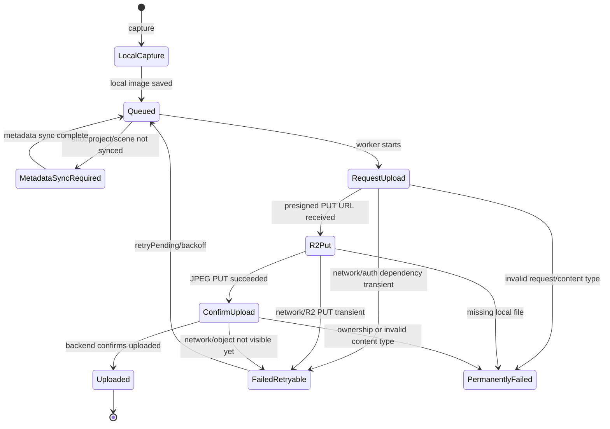

# Media Upload State Machine

## 1. Purpose

Shotup uploads captured media reliably by treating metadata sync and binary transfer as separate, durable workflows. The iOS app captures an image into local storage, records the shot in local SQLite, waits for the shot metadata to exist on the backend, then uploads the JPEG to Cloudflare R2 through presigned URLs issued by the Vapor API.

The upload state machine prevents local media from disappearing after transient failures. Client-side components such as `MediaUploadQueue`, `MediaUploadWorker`, and `URLSessionMediaUploadAPI` own durable local queue state and network execution. Backend components such as `MediaService`, `MediaRepository`, and `R2StorageService` validate dependencies, create `media_assets` rows, issue presigned URLs, verify R2 object existence, and mark media as uploaded.

## 2. Upload Lifecycle Diagram



Linear success path:

```text
local capture -> queued -> metadata sync required -> request-upload -> R2 PUT -> confirm-upload -> uploaded
```

Transient failures return the queue item to retryable state instead of deleting it.

## 3. Local Queue States

### pending

The local queue item exists and is waiting for work. This is the normal state after capture or after a retry is scheduled. A pending item must retain enough information to find the local JPEG and identify `projectID`, `sceneID`, and `frameID`.

### uploading

The upload worker has claimed the item for an active attempt. During this state the worker may call `request-upload`, upload bytes to R2, or call `confirm-upload`. If the app exits or the attempt fails transiently, the item should return to a retryable state rather than being lost.

### failed / retryable

The last attempt failed, but the failure can reasonably succeed later. Examples include network errors, backend dependency readiness errors, expired tokens after refresh, R2 PUT failures, or confirm failures caused by temporary storage visibility. Retryable failures should preserve the local file path and increment retry metadata when available.

### permanently_failed

The item cannot be completed without user action, developer intervention, or data repair. Examples include missing local files, unsupported MIME type, malformed IDs, forbidden ownership checks, or repeated failures past the configured retry policy.

### uploaded

The item is complete from the client perspective. The JPEG was uploaded to R2, `confirm-upload` succeeded, and the backend `media_assets` row is `uploaded`. The queue may retain this state for audit or repair, but it should not schedule more upload attempts unless repair explicitly re-enqueues it.

## 4. Backend States

The backend state is intentionally smaller than the local state machine. `MediaAssetStatus` in `MediaAsset.swift` has:

- `pending`: `request-upload` created or reset a `media_assets` row and returned a presigned R2 PUT URL. The object is not yet confirmed uploaded.
- `uploaded`: `confirm-upload` verified the object exists in R2 and `MediaRepository.markUploaded` stored size, checksum, status, and `uploaded_at`.

`FluentMediaRepository.upsertPendingUpload` can reset an existing asset back to `pending` for a retry or repair upload. `FluentMediaRepository.markUploaded` transitions the row to `uploaded`.

## 5. Detailed Flow

1. Capture creates a local image.
   The iOS app saves the JPEG locally and records the shot and media queue state in local storage.

2. Shot metadata is synced first.
   The project, scene, and shot must exist in PostgreSQL before media upload can begin. The backend validates all three IDs during `request-upload`.

3. The upload worker requests a presigned URL.
   `MediaUploadWorker` sends the queue item through `URLSessionMediaUploadAPI` to `POST /api/v1/media/request-upload` with `projectID`, `sceneID`, `frameID`, and `contentType`.

4. The backend prepares a pending asset.
   `MediaService.requestUpload` verifies ownership, checks that the content type is `image/jpeg`, asks `R2StorageService` for a presigned upload URL, and uses `MediaRepository.upsertPendingUpload` to create or reset a `media_assets` row with status `pending`.

5. iOS uploads the JPEG to R2.
   The client performs an HTTP PUT directly to the presigned R2 URL. The API does not proxy the image bytes.

6. iOS confirms the upload.
   The client calls `POST /api/v1/media/confirm-upload` with `objectKey`, optional checksum, byte size, and MIME type.

7. The backend verifies the object exists.
   `MediaService.confirmUpload` loads the pending asset, validates ownership, checks R2 object existence through `R2StorageService.objectExists`, and validates the MIME type.

8. The backend marks `media_assets` uploaded.
   `MediaRepository.markUploaded` records `size_bytes`, `checksum`, `uploaded_at`, updates `updated_at`, and sets status to `uploaded`.

## 6. Dependency Readiness

The upload worker must treat backend dependency errors as retryable when local metadata may still be syncing:

- `Project not found` means the project dependency is not ready.
- `Scene not found` means the scene dependency is not ready.
- `Frame not found` means the shot/frame dependency is not ready.

These are not permanent upload failures by themselves. They mean metadata sync and media upload are temporarily out of order. The correct response is to retry metadata sync, then retry the media upload queue item.

## 7. Error Handling

Network errors can occur during `request-upload`, R2 PUT, or `confirm-upload`. They are retryable with backoff as long as the local file still exists.

Expired auth should trigger token refresh. If refresh succeeds, the same queue item should retry. If authentication cannot be restored, the item should remain blocked rather than disappearing.

Invalid content type is permanent for the current file. The backend accepts `image/jpeg` for upload and confirm; other MIME types return a bad request.

Missing local file is permanent for the current queue item unless repair can reconstruct or relocate the JPEG. The worker cannot upload bytes it cannot read.

R2 PUT failure is retryable for network, timeout, or transient 5xx cases. It may be permanent for invalid presigned URL usage or a local file read failure. If the URL expires, the worker should request a new upload URL instead of reusing the expired one.

`confirm-upload` failure is retryable for network errors and for object-not-found cases immediately after PUT, because the object may not yet be visible to the backend check. It is permanent for forbidden ownership failures, invalid MIME type, or a missing pending asset that cannot be repaired by re-running `request-upload`.

## 8. Retry Behavior

`retryPending` should reschedule items whose last failure was transient. The queue item must keep enough state to make a new attempt: frame identity, project identity, scene identity, local file location, content type, retry count when available, and last error when available.

Backoff and retry count should prevent hot loops during outages. If the implementation has a configured maximum retry count, reaching it should move the item to `permanently_failed` or an equivalent blocked state for inspection. If a maximum is not configured, retries should still be paced to avoid repeated immediate attempts.

Queue items must not disappear after transient failures because the local JPEG may be the only copy of the original media. Durable retry state is what allows upload to survive app restarts, poor connectivity, dependency races, and temporary backend or R2 errors.

## 9. Traceability

Each upload attempt should use one `X-Trace-ID`. The same trace ID should be sent to both:

- `POST /api/v1/media/request-upload`
- `POST /api/v1/media/confirm-upload`

The backend resolves this through `MediaUploadTrace`. If the header is missing, the API generates one and returns it; the client should prefer generating and preserving one trace ID per attempt.

Structured logs include the trace ID and media events from `MediaController`. Timing fields include:

- `requestDurationMs`: duration of `request-upload`.
- `putDurationMs`: elapsed time between pending asset creation and `confirm-upload` start.
- `confirmDurationMs`: duration of `confirm-upload`.
- `totalDurationMs`: elapsed time from pending asset creation through confirmation completion.

These fields allow one upload attempt to be followed across API URL issuance, client R2 transfer, and backend confirmation.

## 10. Repair Interaction

Orphan repair handles cases where local state says an upload completed but the backend does not have the corresponding `media_assets` row. Repair checks backend media state with `POST /api/v1/media/exists`.

If the backend reports that media is missing, repair can re-enqueue the local media into `MediaUploadQueue`. The normal upload state machine then runs again: metadata readiness, `request-upload`, R2 PUT, `confirm-upload`, and backend `uploaded` state.

This keeps repair behavior consistent with the standard upload path instead of creating a separate upload mechanism.

## 11. Validation

The Phase 7 repair validation completed with:

- 80 shots
- 80 `media_assets`
- 0 orphaned uploads

This confirms that backend-aware repair can reconcile local uploaded state with PostgreSQL media metadata and return the system to a one-to-one shot-to-media-asset result for the tested dataset.
