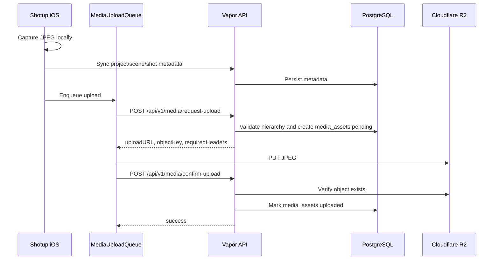
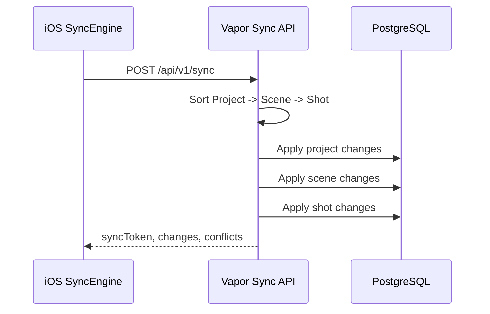
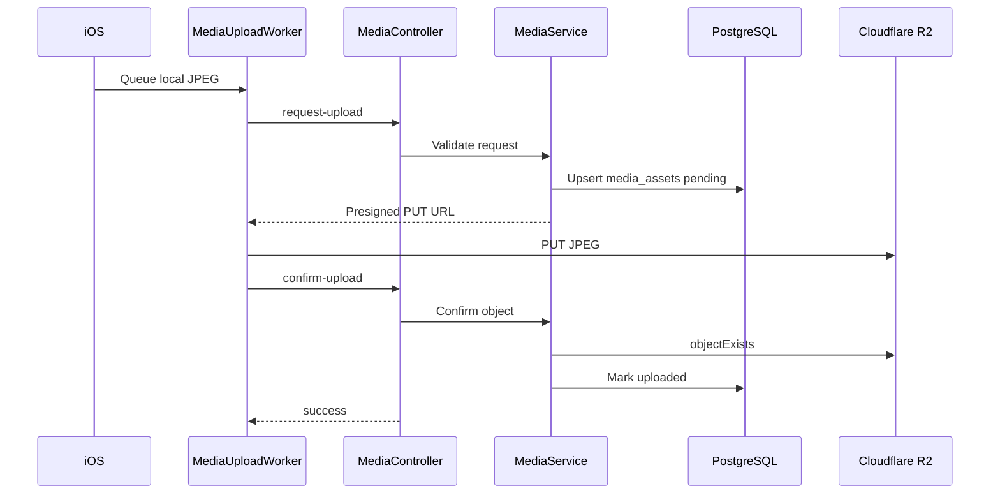
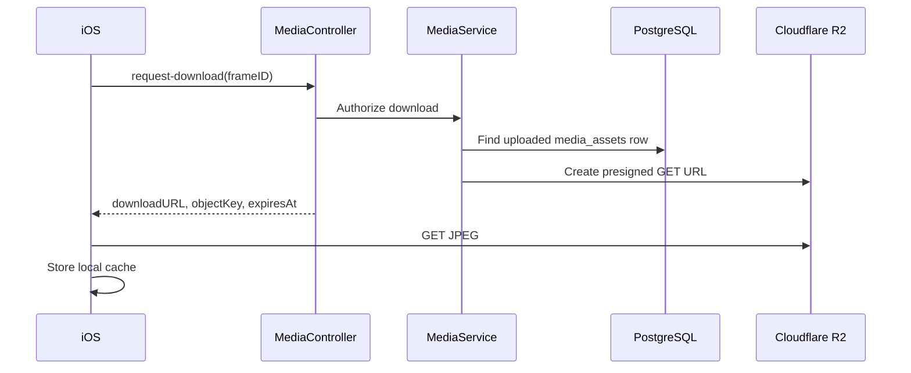
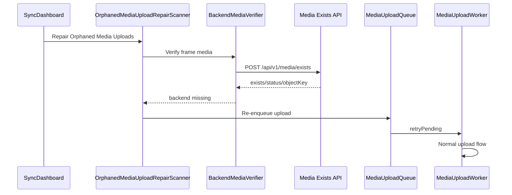

# Shotup Cloud iOS Integration Guide

## Purpose

This document describes how the Shotup iOS application communicates with Shotup Cloud. It defines the integration contract between the iOS repository and the Shotup Cloud backend repository after Phase 7.

## 1. Overview

Shotup Cloud uses a local-first iOS architecture with backend reconciliation for metadata and media.

```text
iPhone
  |
  v
Local SQLite
  |
  v
Sync Engine
  |
  v
HTTPS
  |
  v
Vapor API
  |
  v
PostgreSQL
  |
  v
Cloudflare R2
```

Layer responsibilities:

- iPhone: captures media, stores local state, schedules sync and upload work, and presents user-visible progress.
- Local SQLite: stores local metadata, offline state, sync state, and queue state.
- Sync Engine: pushes and pulls project, scene, and shot metadata through the backend sync API.
- HTTPS: carries authenticated JSON requests between iOS and the Vapor API, plus direct presigned media transfers to R2.
- Vapor API: authenticates users, authorizes operations, applies metadata sync, issues presigned media URLs, and reconciles media metadata.
- PostgreSQL: stores canonical backend metadata, auth sessions, sync events, and `media_assets`.
- Cloudflare R2: stores original JPEG binaries.

The core integration rule is that metadata sync and media transfer are separate but coordinated. A shot can exist locally before it exists on the backend, and a shot can exist on the backend before its original JPEG has finished uploading.

## 2. Responsibility Split

### iOS

Responsible for:

- Camera capture.
- Local media storage.
- Local SQLite metadata.
- Offline queue.
- Retry logic.
- Background uploads.
- Repair scanner.
- Local metadata lifecycle.

Not responsible for:

- Authentication decisions.
- Authorization decisions.
- Object storage credentials.
- Backend media validation.

Key iOS-side integration components:

- `SyncEngine`
- `MediaUploadQueue`
- `MediaUploadWorker`
- `BackendMediaVerifier`
- `OrphanedMediaUploadRepairScanner`
- `SyncDashboard`

### Backend

Responsible for:

- Authentication.
- Authorization.
- Metadata persistence.
- Presigned upload and download URLs.
- Media ownership checks.
- Download authorization.
- Database integrity.

Not responsible for:

- Camera capture.
- Local upload queue persistence.
- Retry scheduling on the device.

Key backend components:

- `MediaController`
- `MediaService`
- `MediaRepository`
- `R2StorageService`
- `SyncService`

## 3. Metadata Sync

Metadata sync moves project hierarchy data between iOS local SQLite and backend PostgreSQL.

```text
Project
  |
  v
Scene
  |
  v
Shot
  |
  v
Success
```

Dependency ordering matters:

- A project must exist before its scenes.
- A scene must exist before its shots.
- A shot must exist before media upload can request a backend upload URL.

The backend `SyncService` sorts incoming sync changes by dependency order: project, then scene, then shot. This protects the backend from batches where a child entity arrives before its parent in the same request.

The iOS `SyncEngine` should also treat dependency errors as retryable. If upload receives `Project not found`, `Scene not found`, or `Frame not found`, the correct response is to retry metadata sync before retrying media upload.

## 4. Media Upload

Media upload transfers captured JPEGs from local iOS storage to Cloudflare R2 while recording backend media state in PostgreSQL.

```text
Capture
  |
  v
Queue
  |
  v
request-upload
  |
  v
R2 PUT
  |
  v
confirm-upload
  |
  v
media_assets uploaded
```

Flow:

1. iOS captures a JPEG and stores it locally.
2. iOS creates or updates local shot metadata.
3. `SyncEngine` syncs project, scene, and shot metadata first.
4. `MediaUploadQueue` stores a durable upload item.
5. `MediaUploadWorker` calls `POST /api/v1/media/request-upload`.
6. `MediaController` delegates to `MediaService`.
7. `MediaService` validates project, scene, shot, ownership, and MIME type.
8. `R2StorageService` returns a presigned R2 PUT URL.
9. `MediaRepository` creates or resets a `pending` `media_assets` row.
10. iOS uploads the JPEG directly to R2.
11. iOS calls `POST /api/v1/media/confirm-upload`.
12. The backend verifies the R2 object exists.
13. `MediaRepository` marks the `media_assets` row `uploaded`.



## 5. Media Download

Media download restores remote JPEG media into local device storage.

```text
request-download
  |
  v
presigned URL
  |
  v
JPEG download
  |
  v
Local cache
```

Flow:

1. iOS identifies a frame with missing local media.
2. iOS calls `POST /api/v1/media/request-download` with `frameID`.
3. `MediaService` finds the uploaded `media_assets` row.
4. The backend verifies ownership and status.
5. `R2StorageService` creates a presigned R2 GET URL.
6. iOS downloads the JPEG and stores it in local media cache.

The download pipeline is supported by the Phase 7 backend contract. Client-side automatic download scheduling is a Phase 8 hardening area.

## 6. Media Exists Verification

Media existence verification supports repair and reconciliation. It answers whether the backend has a `media_assets` row for a frame.

```text
Repair Scanner
  |
  v
POST /media/exists
  |
  +--> exists == true
  |       |
  |       v
  |      skip
  |
  +--> exists == false
          |
          v
       markFailed
          |
          v
       retryPending
          |
          v
       upload worker
```

`BackendMediaVerifier` calls `POST /api/v1/media/exists`. The backend performs a database lookup only. It does not call R2, does not issue a presigned URL, and does not require the media to be downloadable.

This endpoint should be used by `OrphanedMediaUploadRepairScanner` instead of using `request-download` as a probe. Download is a transfer operation; existence verification is a reconciliation operation.

## 7. Retry Strategy

Transient failures should keep queue items durable and retryable.

Retryable failures:

- Network unavailable.
- DNS, TLS, timeout, or connection reset.
- Dependency not ready.
- Server temporarily unavailable.
- R2 PUT timeout.
- `confirm-upload` object not visible yet.
- Expired access token after successful refresh.

Dependency failures are retryable:

- `Project not found`
- `Scene not found`
- `Frame not found`

Permanent failures:

- Unauthorized authentication state that cannot be refreshed.
- Forbidden ownership response.
- Missing local file.
- Unsupported content type.
- Malformed request data.

The iOS queue should not delete media work after transient failures. `retryPending` should reschedule retryable items, while permanent failures should be explicit and visible in developer/debug tooling.

## 8. Repair Workflow

The historical failure was a mismatch between local queue state and backend media metadata:

- A shot existed.
- The local upload queue said media was uploaded.
- The backend had no matching `media_assets` row.

Phase 7 repair uses backend reconciliation:

1. `OrphanedMediaUploadRepairScanner` scans local uploaded media state.
2. `BackendMediaVerifier` calls `POST /api/v1/media/exists`.
3. If the backend reports missing media, iOS marks the local item failed or retryable.
4. `retryPending` re-enqueues the item.
5. `MediaUploadWorker` runs the normal upload flow.
6. `confirm-upload` marks the backend row uploaded.

Manual repair can be initiated from `SyncDashboard` in debug tooling. The repair model is eventually consistent: immediate cloud consistency is not required, but every local media item must remain recoverable until backend confirmation succeeds.

## 9. Security Model

Shotup Cloud uses JWT Bearer authentication for protected API routes.

Security properties:

- iOS sends `Authorization: Bearer {accessToken}`.
- Backend validates JWTs.
- Backend performs ownership validation against PostgreSQL.
- R2 credentials are never sent to iOS.
- iOS receives only presigned URLs for specific operations.
- Presigned URLs have short expiration.
- Object keys are storage identifiers, not authorization proof.
- Current upload validation accepts `image/jpeg`.

The backend is responsible for authentication and authorization decisions. iOS is responsible for preserving tokens securely and sending them with protected API requests.

## 10. Data Ownership

iOS owns:

- Temporary media before upload.
- Local JPEG files.
- Upload queue state.
- Offline state.
- Local sync state.

Backend owns:

- Projects.
- Scenes.
- Shots.
- `media_assets`.
- Auth sessions.
- Authorization decisions.

R2 owns:

- Binary JPEG objects.

The bridge between backend metadata and R2 binaries is `media_assets.object_key`.

## 11. Sequence Diagrams

### Metadata Sync



### Media Upload



### Media Download



### Repair Workflow



## 12. Current Validated Flow

Phase 7 validation confirms:

- Metadata sync works for project, scene, and shot hierarchy.
- Media upload works through `request-upload`, R2 PUT, and `confirm-upload`.
- Media download backend contract exists through `request-download`.
- Media existence endpoint works for backend reconciliation.
- Repair scanner flow can re-enqueue backend-missing media.
- Backend reconciliation restores missing `media_assets`.
- Final validation result:
  - 80 shots
  - 80 `media_assets`
  - 0 orphaned media

## 13. Future Integration

Future integration areas:

- Background sync.
- Push notifications.
- Multi-device conflict resolution.
- Project collaboration.
- Selective sync.
- Video uploads.
- Cloud thumbnails.
- Streaming downloads.
